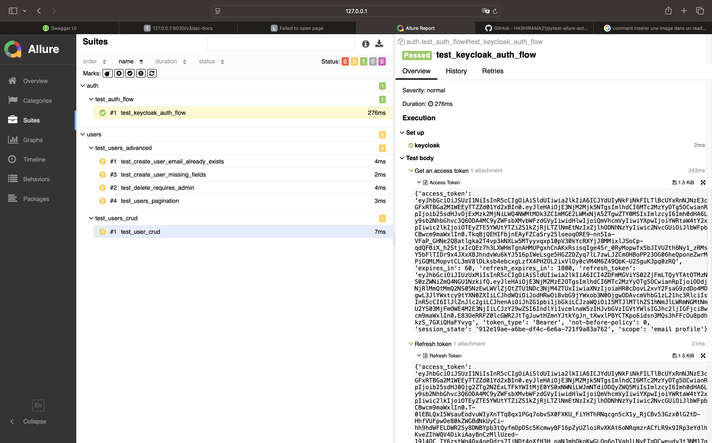
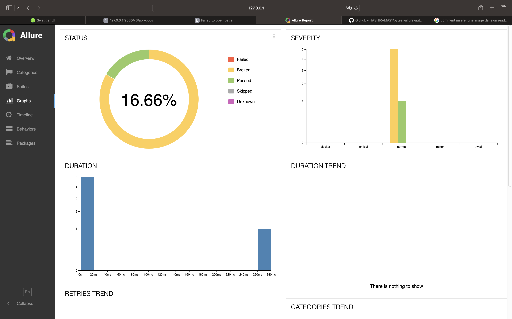

# Pytest Automation Project with Allure Reporting

A comprehensive test automation framework built with Pytest and Allure reporting for testing Keycloak authentication flows and REST API endpoints. This project demonstrates automated testing best practices with detailed reporting and CI/CD integration.

## Project Overview

This test automation framework provides:
- **Authentication Testing**: Keycloak token management and authentication flows
- **API Testing**: Complete CRUD operations for user management
- **Advanced Test Scenarios**: Edge cases, validation, authorization, and pagination
- **Allure Reporting**: Rich HTML reports with step-by-step execution details
- **CI/CD Integration**: Automated test execution with GitHub Actions

## Project Structure

```
pytest-projet/
├── auth/
│   └── test_auth_flow.py          # Authentication and token management tests
├── users/
│   ├── test_users_crud.py         # Basic user CRUD operations
│   └── test_users_advanced.py     # Advanced user scenarios and edge cases
├── config/
│   └── configs.py                 # Configuration settings
├── utils/
│   └── keycloak_client.py         # Keycloak client implementation
├── allure-results/                # Allure test results (generated)
├── .github/workflows/
│   └── workflow.yml               # CI/CD pipeline configuration
├── conftest.py                    # Pytest fixtures and configuration
├── pyproject.toml                 # Project dependencies and configuration
└── .env                          # Environment variables
```

## Features

### Test Categories

#### 1. Authentication Flow Tests (`auth/test_auth_flow.py`)
- **Keycloak Token Acquisition**: Tests for obtaining access tokens using credentials
- **Token Refresh**: Validates refresh token functionality
- **Security Integration**: Ensures proper authentication flow with Keycloak

#### 2. User CRUD Operations (`users/test_users_crud.py`)
- **Create User**: Tests user creation with valid data
- **Read User**: Validates user retrieval operations
- **Delete User**: Tests user deletion functionality
- **Complete Workflow**: End-to-end user lifecycle testing

#### 3. Advanced User Scenarios (`users/test_users_advanced.py`)
- **Duplicate Email Validation**: Tests handling of duplicate user emails (409 Conflict)
- **Authorization Testing**: Validates admin role requirements for delete operations (403 Forbidden)
- **Input Validation**: Tests handling of missing or invalid fields (422 Unprocessable Entity)
- **Pagination**: Tests user list pagination functionality

### Allure Reporting Integration

The project includes comprehensive Allure reporting with:
- **Feature Organization**: Tests grouped by functional areas
- **Story Mapping**: Individual test scenarios with descriptive stories
- **Step Documentation**: Detailed step-by-step execution logs
- **Attachments**: Request/response data, tokens, and error messages
- **Visual Reports**: Rich HTML reports with graphs and statistics

#### Allure Decorators Used:
- `@allure.feature()`: Groups tests by major functionality
- `@allure.story()`: Describes specific test scenarios
- `allure.step()`: Documents individual test steps
- `allure.attach()`: Adds request/response data and evidence

## Dependencies

### Core Testing Framework
- **pytest** (>=9.0.1): Primary testing framework
- **allure-pytest** (>=2.15.0): Allure reporting integration
- **allure-python-commons** (>=2.15.0): Allure core functionality

### Additional Libraries
- **requests** (>=2.32.5): HTTP client for API testing
- **python-dotenv** (>=1.2.1): Environment variable management

## Setup and Installation

### Prerequisites
- Python 3.12 or higher
- Keycloak server running on localhost:8080
- API server running on localhost:8000

### Installation Steps

1. **Clone the repository**
```bash
git clone <repository-url>
cd pytest-projet
```

2. **Create virtual environment**
```bash
python -m venv .venv
source .venv/bin/activate  # On Windows: .venv\Scripts\activate
```

3. **Install dependencies**
```bash
pip install -r requirements.txt
# or using the project configuration
pip install -e .
```

4. **Configure environment variables**
Copy `.env.example` to `.env` and configure:
```env
KEYCLOAK_BASE_URL=http://localhost:8080
KEYCLOAK_REALM=master
KEYCLOAK_CLIENT_ID=test_client
KEYCLOAK_CLIENT_SECRET=your_secret
KEYCLOAK_USERNAME=admin
KEYCLOAK_PASSWORD=admin
API_BASE_URL=http://localhost:8000
```

5. **Install Allure CLI** (for local report generation)
```bash
# macOS
brew install allure

# Ubuntu/Debian
sudo apt-add-repository ppa:qameta/allure
sudo apt-get update
sudo apt-get install allure

# Windows
scoop install allure
```

## Running Tests

### Execute All Tests
```bash
pytest --alluredir=allure-results
```

### Run Specific Test Categories
```bash
# Authentication tests only
pytest auth/ --alluredir=allure-results

# User CRUD tests only
pytest users/test_users_crud.py --alluredir=allure-results

# Advanced user scenarios only
pytest users/test_users_advanced.py --alluredir=allure-results
```

### Generate and View Allure Report
```bash
# Generate HTML report
allure generate allure-results -o allure-report --clean

# Serve report locally
allure serve allure-results
```

## Test Cases Documentation

### Authentication Tests
| Test Case | Description | Expected Result |
|-----------|-------------|----------------|
| `test_keycloak_auth_flow` | Complete authentication flow with token refresh | Access token received and refresh token validated |

### User CRUD Tests
| Test Case | Description | Expected Result |
|-----------|-------------|----------------|
| `test_user_crud` | Complete user lifecycle (create, read, delete) | User created (201), retrieved (200), deleted (204) |

### Advanced User Tests
| Test Case | Description | Expected Result |
|-----------|-------------|----------------|
| `test_create_user_email_already_exists` | Duplicate email validation | Second creation returns 409 Conflict |
| `test_delete_requires_admin` | Authorization validation for delete | Non-admin user receives 403 Forbidden |
| `test_create_user_missing_fields` | Input validation with missing fields | Invalid request returns 422 Unprocessable Entity |
| `test_users_pagination` | User list pagination functionality | Paginated response with correct structure |

## CI/CD Automation

### GitHub Actions Workflow

The project includes a comprehensive CI/CD pipeline (`.github/workflows/workflow.yml`) that:

1. **Triggers**: Runs on push to `main`/`develop` branches and pull requests
2. **Environment Setup**: Configures Python 3.12 and installs dependencies
3. **Test Execution**: Runs all tests with Allure reporting
4. **Report Generation**: Creates HTML reports from test results
5. **Artifact Storage**: Uploads Allure reports as GitHub Actions artifacts

### Workflow Features:
- **Secure Configuration**: Uses GitHub Secrets for sensitive data
- **Allure Integration**: Automatically installs Allure CLI and generates reports
- **Artifact Management**: Stores test reports for download and review
- **Multi-branch Support**: Supports both main and develop branch workflows

### Environment Variables for CI/CD:
Configure these secrets in your GitHub repository:
- `KEYCLOAK_BASE_URL`
- `KEYCLOAK_REALM`
- `KEYCLOAK_CLIENT_ID`
- `KEYCLOAK_CLIENT_SECRET`
- `KEYCLOAK_USERNAME`
- `KEYCLOAK_PASSWORD`
- `API_BASE_URL`

## Fixtures and Configuration

### Global Fixtures (`conftest.py`)
- `keycloak`: Session-scoped Keycloak client instance
- `access_token`: Session-scoped access token for API authentication
- `auth_header`: Function-scoped authorization headers
- `refresh_token`: Session-scoped refresh token management
- `load_env`: Environment variable loading

### Configuration Management (`config/configs.py`)
Centralized configuration with default values for:
- Keycloak server settings
- API endpoint configurations
- Authentication parameters

## Allure Report Examples






## Best Practices Implemented

### Test Organization
- **Feature-based Structure**: Tests organized by functionality
- **Separation of Concerns**: Authentication, CRUD, and advanced scenarios separated
- **Reusable Fixtures**: Shared authentication and configuration fixtures

### Reporting Excellence
- **Comprehensive Documentation**: Every test step documented with Allure
- **Evidence Capture**: Request/response data attached to reports
- **Visual Organization**: Features and stories provide clear test structure

### CI/CD Integration
- **Automated Execution**: Tests run automatically on code changes
- **Report Accessibility**: HTML reports available as downloadable artifacts
- **Secure Configuration**: Sensitive data managed through GitHub Secrets

### Error Handling
- **Status Code Validation**: Appropriate HTTP status codes verified
- **Edge Case Coverage**: Duplicate data, invalid inputs, authorization failures
- **Comprehensive Assertions**: Multiple validation points per test case

## Contributing

1. Follow the existing test structure and naming conventions
2. Add appropriate Allure decorators for new tests
3. Include comprehensive assertions and error handling
4. Update this README when adding new features or test categories
5. Ensure all tests pass in the CI/CD pipeline before merging

## Troubleshooting

### Common Issues
- **Connection Errors**: Verify Keycloak and API servers are running
- **Authentication Failures**: Check credentials in `.env` file
- **Missing Dependencies**: Ensure all packages are installed correctly
- **Allure Report Issues**: Verify Allure CLI is properly installed

### Debug Mode
Run tests with verbose output:
```bash
pytest -v -s --alluredir=allure-results
```